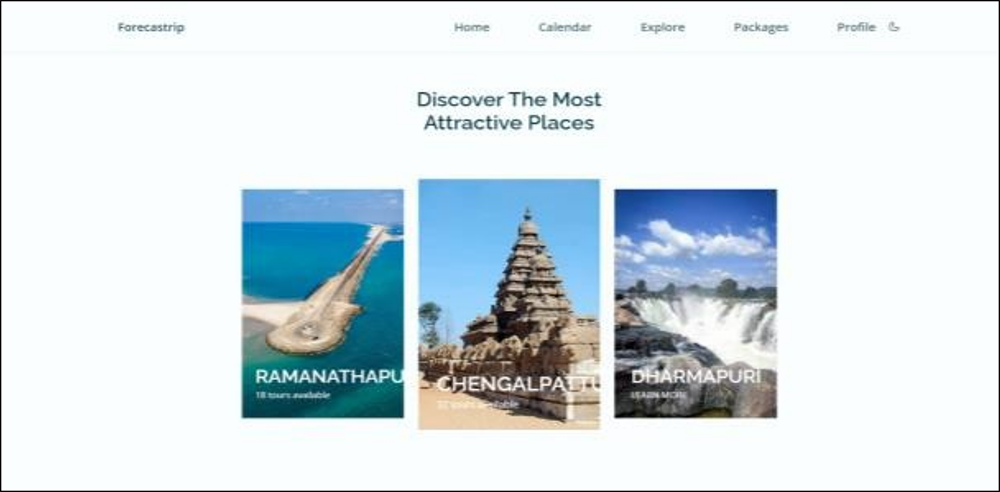
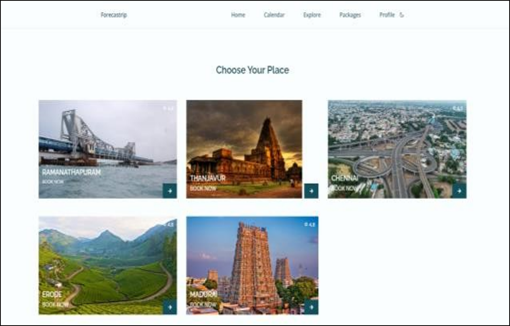
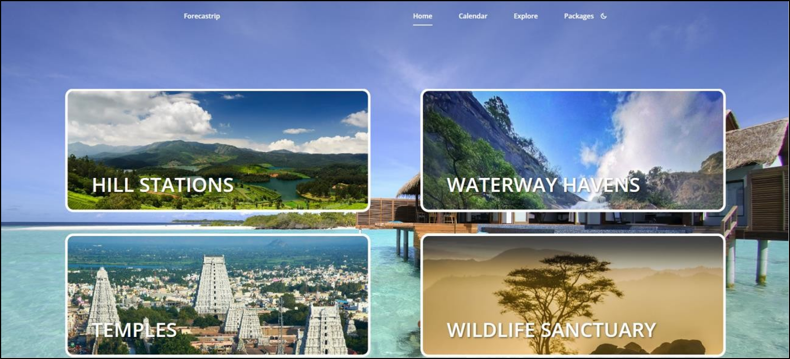
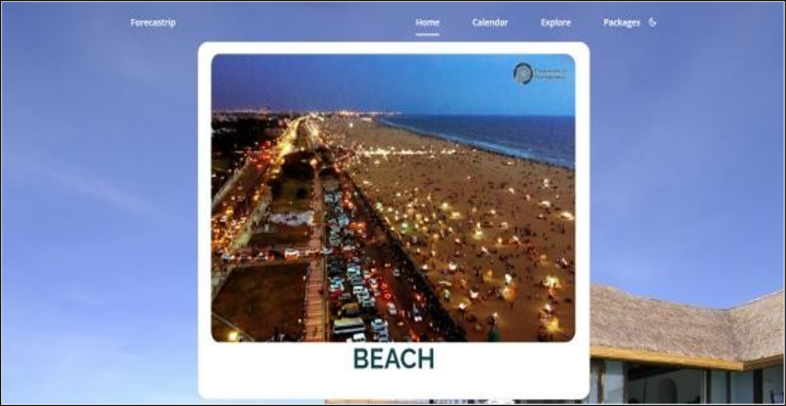
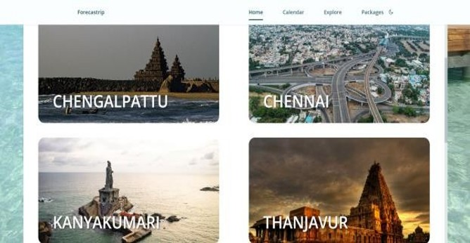
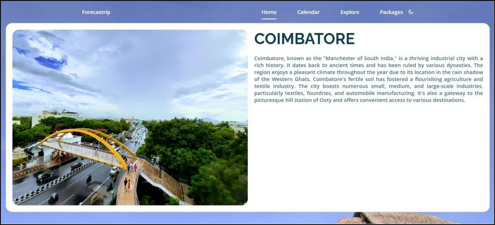
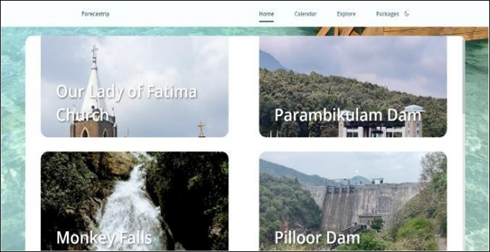
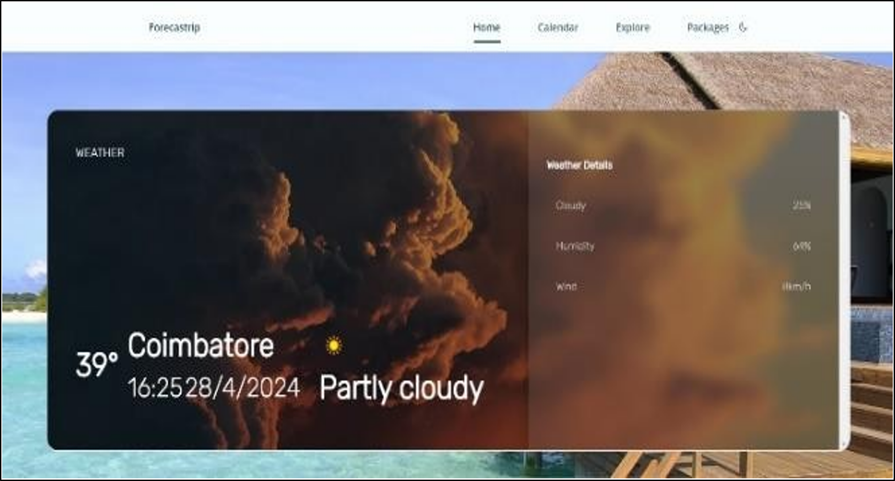
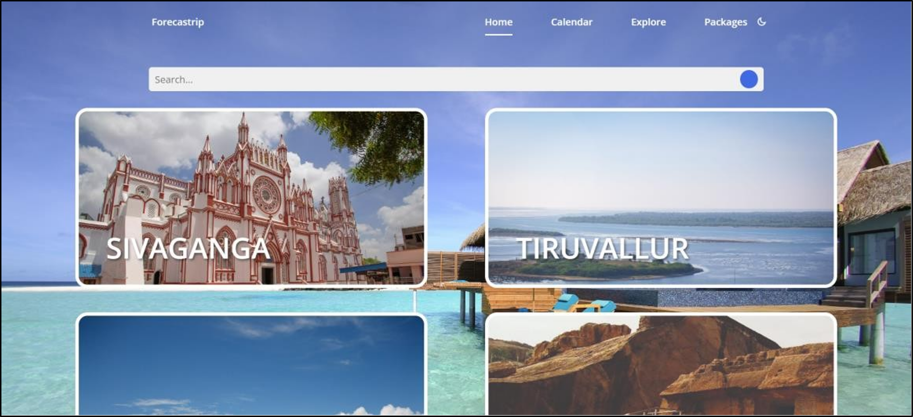

# Forecastrip 🌍 — ML-Based Trip Planning (Web App)

Forecastrip is a machine learning–powered travel planning web application that helps travellers plan and optimize their trips based on their preferences, budget, and constraints. It provides personalized recommendations for cities, hotels, activities, and transportation, along with real-time weather and route information — eliminating the need for third-party guides and reducing hidden booking costs.

> This repository contains the **web application** portion of the Forecastrip project (the Android app is maintained separately / not included here).

---

## 📌 Features

- **Personalized City Recommendations** — Uses collaborative filtering (cosine similarity) on user booking/viewing history to recommend cities similar users have enjoyed.
- **Explore Page** — Browse all destinations with high-quality images and a search bar to quickly find specific cities.
- **City Details Page** — In-depth information about tourist spots, along with a 7-day weather forecast for the selected destination.
- **Popular Packages** — Curated, season-based travel packages (e.g. beach destinations in summer) grouped by city.
- **Direct Booking** — Book hotels, flights, and transportation directly within the platform, cutting out third-party intermediaries and hidden fees.
- **Route Information** — Get the best and most cost-effective route/transportation options to a destination.
- **Secure Authentication** — Firebase Authentication for sign-up/login and secure session management.
- **Real-Time Database** — Firebase Firestore stores user profiles, packages, and city data with offline support and automatic sync.

---

## 🛠️ Tech Stack

| Layer          | Technology                          |
|----------------|--------------------------------------|
| Frontend       | HTML, CSS, JavaScript, Bootstrap     |
| Authentication | Firebase Authentication              |
| Database       | Firebase Firestore                   |
| File Storage   | Firebase Storage                     |
| Hosting        | Firebase Hosting                     |
| Machine Learning | Python (collaborative filtering / cosine similarity for recommendations) |

---

## 📂 Project Structure

```
forecastrip-web/
├── index.html              # Landing / welcome page
├── discover.html           # Discover / recommendations page
├── explore.html            # Explore all cities
├── city.html                # City detail page
├── packages.html            # Popular packages page
├── css/                     # Stylesheets (Bootstrap + custom)
├── js/                      # JavaScript (Firebase queries, ML recommendation calls, etc.)
├── assets/                  # Images and static assets
├── screenshots/             # Project output screenshots (see below)
└── README.md
```

> ⚠️ Update the tree above to match your actual folder/file names if they differ.

---

## ⚙️ Installation & Setup

1. **Clone the repository**
   ```bash
   git clone https://github.com/<your-username>/forecastrip-web.git
   cd forecastrip-web
   ```

2. **Set up Firebase**
   - Create a project on the [Firebase Console](https://console.firebase.google.com/).
   - Enable **Authentication** (Email/Password), **Cloud Firestore**, and **Storage**.
   - Copy your Firebase config keys into your project's JS config file (e.g. `js/firebase-config.js`).

3. **Run locally**
   - Since this is a static HTML/CSS/JS project, you can open `index.html` directly in a browser, or serve it with a lightweight local server:
     ```bash
     npx serve .
     ```
   - Or deploy directly using Firebase Hosting:
     ```bash
     firebase login
     firebase init hosting
     firebase deploy
     ```

---

## 🧠 Machine Learning — Recommendation Engine

The city recommendation module uses **collaborative filtering**:

1. User profiles are built from past bookings/viewings.
2. A **cosine similarity** score is calculated between user pairs (ranging from -1 to 1) to measure how closely their interests align.
3. For a given user, cities that similar users rated highly (but the current user hasn't visited) are recommended.

Recommended cities are surfaced on the **Discover** page under "Popular Cities."

---


## 📸 Screenshots

### Home Page


### Discover Page


### Recommendation Page


### Popular Packages







### City Page








### Explore Page


---

## 👥 Contributors

- Kabilan K
- Ramanan M
- Ashwanth S P
- Barath K N

**Guide:** Ms. P. Rajeswari, Department of Computer Engineering, PSG Polytechnic College

---

## 🚀 Future Scope

- Integration with travel-gear/kit ordering for specific destinations.
- In-app messaging so travellers can share tips and recommendations with each other.

---

## 📄 License

This project was developed as part of the Diploma in Computer Engineering curriculum (State Board of Technical Education, Government of Tamil Nadu). Add a license of your choice (e.g. MIT) if you plan to open-source this repository.
